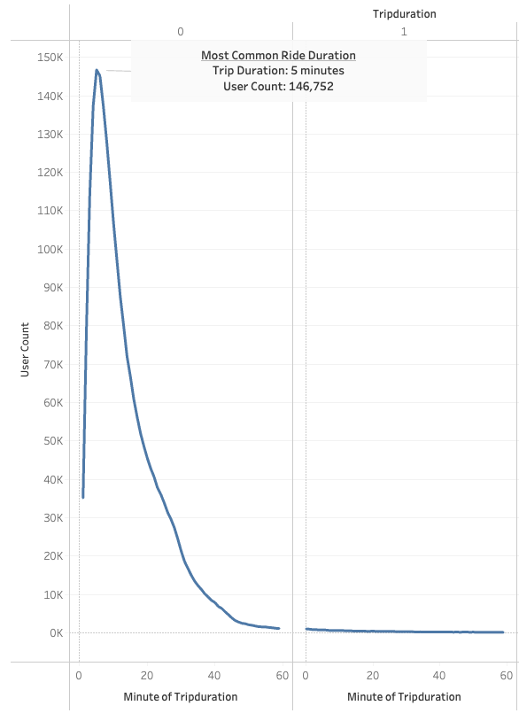

# Overview

This project utilized NYC bike sharing data from the month of August 2019 to extract key findings via Tableau visualizations. 

The dataset contained information relating to 2,344,244 bike rides, and covered bike sharing subscribers, one time customers, and even featured breakdowns for user gender.

Link to the Tableau Story: [view here](https://public.tableau.com/views/NYC_BikeSharing/NYCBikeShareAnalysis?:language=en-US&publish=yes&:display_count=n&:origin=viz_share_link)

# Results

## Overview of Ride Duration

The most common ride duration was five minutes

*Fig.1 - most trip common duration of bike ride*

By gender:
- Male riders far out numbered female riders
- Most common trip durations were very similar across genders, at five and six minutes.

*Fig. 2 - most common trip duration by gender*

## Peak Usage

Peak usage, as determined by trip starttime (the hour in which the bike was rented) is realized on weekdays, surrounding the standard work hours of 9am-5pm. 

*Fig. 3 - bike rental volume by hour, by day of the week*

*Fig. 4 - highlight of peak hours*

Conversely, weekends display the opposite patterns of use, showing heavy use during the hours of 9am-7pm. This stretch is extended on Saturdays (9am-7pm), and shortened on Sundays  (10am-5pm).

## "Unknown" Gender

> **Important note about the following section**: In the dataset, gender data is broken into three categories: Male, Female, and Unknown. Many questionnaires in modern times feature additional gender entries, in addition to the "I'd prefer not to say" option. The specific wording "unknown" implies that this third category represents "null" values only, and this analysis bases its gender analysis on that assumption. One recommendation stemming from this analysis would be to ensure a third option is available, which would clarify whether a user truly failed to fill out their profile in its entirety or if a user did not feel represented by the available choices.

Non-subscriber customer profiles are most commonly lacking additional metadata, such as gender information. The most frequent occurrence of these users are on the weekends, with a peak on Saturdays totaling 55,375. In fact, the unknown dataset trumps the male/female datasets individually, suggesting that single-use, non-subscriber rides are more akin to impulse buys; the quicker someone can rent a bike and ride, the more likely single-use customers are to participate.

*Fig. 5 - gender/subscriber analysis*

*Fig. 6 - unknown gender analysis*

*Fig. 7 - customer analysis across genders*

## Bike Maintenance Window

Ride data overall reflects the early morning hours of 1:00am to 4:00am as hours of least usage. Looking more granularly, weekday mornings present the least usage of all the days of the week

Moreover, a view of ride count by bike shows certain bikes are more frequently rented and therefore will require more maintenance. These can be proactively targeted for maintenance to reduce costs associated with repairs. 

# Summary

In summary, the data shows the following:
- Working commute opportunities present the strongest sales opportunities
- The easier it is for a user to purchase a one time rental, the more impulse sales are generated
- Bike maintenance can be focused to certain hours of least usage, and focused on certain bikes that see the more frequent usage. 

## Additional Visualizations

The following two visualizations were created:
- Starting locations by gender
- Ending locations by gender

Analyzing starting locations by gender, we immediately see that most locations are shared except for a grouping in the Bronx. Zooming in, we can see unique Male and Female rental locations.

Analyzing ending locations by gender, we again see that most locations are shared. Looking individually by gender we notice entries in New Jersey unique to Male riders. From the data we see women do not ride their bikes to New Jersey. 

